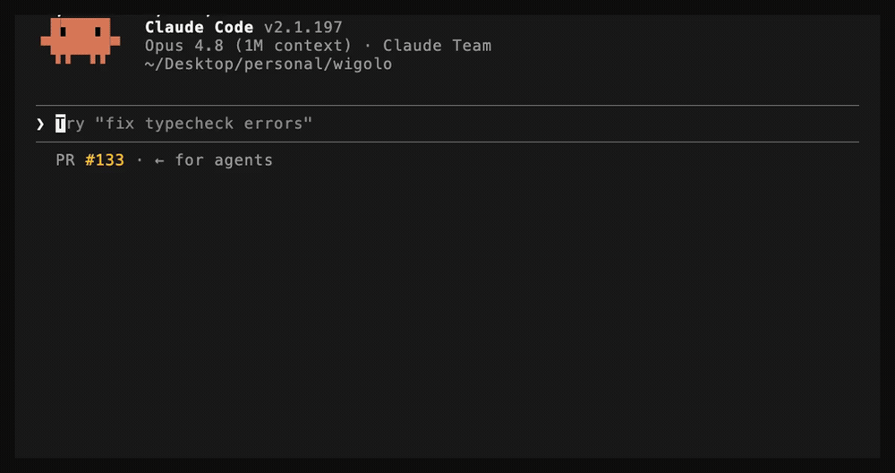
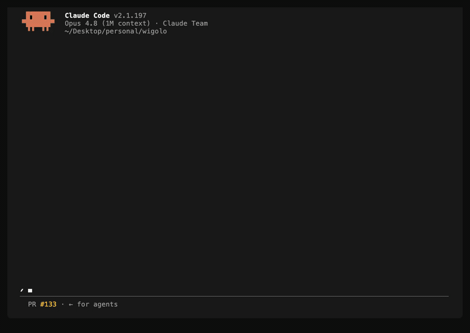
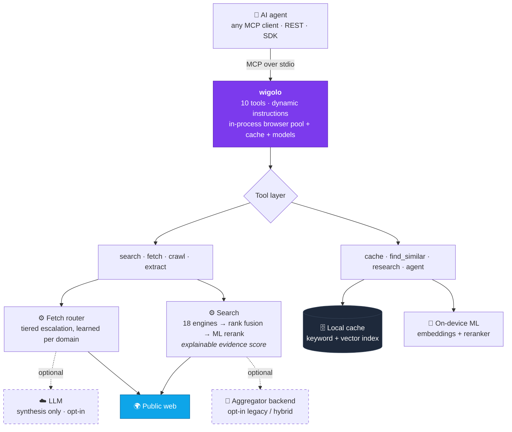

<div align="center">


AI エージェント向けのローカルファーストな Web インテリジェンス — **キー不要、クラウド不要、従量課金なし。**

<sub>対応&nbsp;&nbsp;**Claude Code · Cursor · Codex · Gemini CLI · VS Code · Windsurf · Zed · Antigravity**</sub>
<br>
<sub>さらに&nbsp;&nbsp;**LangChain · CrewAI · LlamaIndex · Vercel AI SDK · n8n とセルフホスト型エージェント · あらゆる MCP クライアント · 素の REST**</sub>

[](https://www.npmjs.com/package/wigolo)
[](https://www.npmjs.com/package/wigolo)
[](https://github.com/KnockOutEZ/wigolo/stargazers)
[](https://github.com/KnockOutEZ/wigolo/actions/workflows/ci.yml)
[](https://nodejs.org)
[](https://modelcontextprotocol.io)
[](#ライセンス)
[](#ベータ版とフィードバック)
[](https://x.com/yourtowhid)

<a href="https://trendshift.io/repositories/79424?utm_source=repository-badge&utm_medium=badge&utm_campaign=badge-repository-79424" target="_blank"></a>
<a href="https://trendshift.io/repositories/79424?utm_source=trendshift-badge&utm_medium=badge&utm_campaign=badge-trendshift-79424" target="_blank" rel="noopener noreferrer"></a>

[English](README.md) · [简体中文](README.zh-CN.md) · [日本語](README.ja.md)

[クイックスタート](#クイックスタート) · [ツール](#ツール) · [wigolo の違い](#違い) · [ベンチマーク](#ベンチマーク) · [ドキュメント](docs/README.md) · [例](examples/README.md) · [フィードバック](#ベータ版とフィードバック) · [よくある質問](#よくある質問)

新機能とアップデートは継続的にリリースされます。X で <a href="https://x.com/yourtowhid"><b>@yourtowhid</b></a> をフォローして、すべての更新情報や wigolo の新しい活用方法をご覧ください。協業やフィードバックについては X、または <a href="https://www.linkedin.com/in/yourtowhid/">LinkedIn</a> からご連絡ください。

</div>

---

wigolo は、Web に関するあらゆる操作を AI エージェント向けの一つのインターフェースにまとめます。対象は**検索、取得、クロール、抽出、キャッシュ、類似検索、リサーチ**、そして自律的な収集ループです。エージェントが動く場所ならどこでも実行できます。コーディングエージェントの隣で MCP サーバーとして、セルフホスト型エージェントが動くマシン上で REST/MCP エンドポイントとして、あるいは SDK を通じて独自アプリに組み込めます。中核ツールに API キーは不要で、扱ったデータが `~/.wigolo/` の外に出ることはなく、エージェントが考えるほど請求額が増えることもありません。

<div align="center">



</div>

## クイックスタート

```bash
npx wigolo init                              # set up the local engine — any system
npx wigolo init --agents=claude-code,cursor  # …or set up + wire your day-to-day agents in one command
```

**Node ≥ 20** と、macOS、Linux、Windows のいずれかで約 1.5 GB の空きディスク容量が必要です。引数なしの `init` はローカルエンジンをセットアップします。ブラウザーエンジンとオンデバイスモデルをダウンロードし、ヘルスチェックを実行して各コンポーネントを報告します。`--agents` を追加すると同じ実行内で指定したエージェントも接続されるため、日常的に使うコーディングエージェントを一つのコマンドで利用可能にできます。

- **対応エージェント** — `--agents` には `claude-code`、`cursor`、`codex`、`gemini-cli`、`vscode`、`windsurf`、`zed`、`antigravity` の任意の組み合わせを指定できます（カンマ区切り）。wigolo は各エージェントの MCP 設定と指示を書き込みます。
- **その他のセットアップ** — あらゆる MCP クライアント、エージェントフレームワーク、セルフホスト型エージェントは、自身の MCP 設定に `npx -y wigolo` を登録できます。[インストールガイド](docs/installation.md)には、各クライアント向けの正確な設定ブロックに加え、Docker、Homebrew、単一ファイルバイナリの導入方法があります。
- **今後も追加予定** — 対応リストは拡大を続けています。お使いのエージェントを追加する PR も歓迎します。[CONTRIBUTING.md](CONTRIBUTING.md) をご覧ください。
- **対話型セットアップ** — `--interactive` はプレーンテキストのフロー、`--wizard` は完全なターミナル TUI です。
- **ダウンロードの延期** — `--no-warmup` は初回利用までダウンロードを待ちます。コンポーネントのダウンロード失敗でセットアップ全体が失敗することはありません。init は準備できていない項目と正確な修正方法を報告し、そのまま完了します。

`init` は既定で無人実行されるため、スクリプトや CI でも安全に利用できます。セットアップ上の問題は、エージェントが初めて呼び出す前に、このコンポーネント別レポートへ表示されます。**検索、取得、クロール、抽出、キャッシュ、類似検索は API キーなしで動作します。**次のコマンドでいつでも状態を確認できます。

```bash
npx wigolo doctor
```

すべてをきれいに削除するには `npx wigolo config --uninstall --yes` を実行します。[インストールガイド](docs/installation.md)を任意の AI アシスタントに貼り付け、セットアップを任せることもできます。このガイドは単独で完結するように書かれています。

### 推奨 — `research` と `agent` 用の無料キー

検索、取得、クロール、抽出、キャッシュ、類似検索は**完全にキー不要**です。`research`、`agent`、`search format=answer` は LLM を使い、統合された引用付きの回答を作成します。LLM がない場合は、エージェントがまとめられるように生のブリーフと証拠を返します。無料の Gemini キーを使えば、完成した回答を生成できます。

```bash
export WIGOLO_LLM_PROVIDER=gemini
export GEMINI_API_KEY=<free-key>      # grab one at aistudio.google.com/apikey — the free tier is plenty
```

どのプロバイダーでも利用できます（`anthropic`、`openai`、`groq`）。`WIGOLO_LLM_PROVIDER=ollama`（または任意の OpenAI 互換 URL）を指定すれば、完全にローカルかつキーなしでも利用できます。シェルまたはエージェントの MCP `env` ブロックに設定してください。プロバイダー、モデル、キー不要のローカルモデルフォールバックについては[設定ガイド](docs/configuration.md)をご覧ください。

## エージェントが受け取るもの

各検索結果は、エージェントが行動に利用できる証拠です。ソース内の正確な位置に固定された逐語的な抜粋、エージェントが引用できる引用 ID、そして確認可能なスコアが含まれます（以下は実際の形式を簡略化したものです）。

```jsonc
{
  "results": [{
    "title": "Logical replication - PostgreSQL docs",
    "url": "https://www.postgresql.org/docs/current/logical-replication.html",
    "excerpt": "Logical replication is a method of replicating data objects…",
    "citation_id": "src-1",
    "source_span": { "start": 1042, "end": 1305 },          // byte-exact provenance
    "evidence_score": { "final": 0.86, "semantic": 0.91, "lexical": 0.78, "engine_consensus": 3 }
  }],
  "citations": [{ "id": "src-1", "url": "…" }],
  "freshness_signal": { "published": "2026-05-12", "confidence": "high" }
}
```

品質の低い結果は wigolo 自身のスコアラーによって不要な結果としてマークされます。失敗したエンジンは報告され、古いキャッシュにもラベルが付くため、エージェントは常に何を根拠にしているか把握できます。ツールごとの完全なレスポンス契約は[ツールリファレンス](docs/tools.md)にあります。

## ツール

| ツール | 機能 |
|------|--------------|
| 🔎 `search` | 複数エンジンによる Web 検索（18 の直接アダプター）。ランキング融合、ML 再ランキング、説明可能な結果別スコアを備えています。クエリの**配列**を渡すと、並列に広く検索できます。ドメインと期間による絞り込み、完全一致フレーズ、画像結果にも対応します。 |
| 📄 `fetch` | 段階的ルーターを通じて一つの URL を読み込みます。ボット対策や SPA シェルを検出すると、通常の HTTP からヘッドレスブラウザーへ自動的に切り替わります。きれいな Markdown、メタデータ、リンクを返します。PDF、単一見出しの `section`、認証済みセッション、ページ操作（クリック、入力、スクロール、スクリーンショット）に対応します。 |
| 🕸️ `crawl` | 複数ページをクロールします。BFS、DFS、サイトマップ、マップのみのモードを選べます。ドメインごとのレート制限、robots.txt の尊重、定型部分の重複排除に対応します。 |
| 🧩 `extract` | ページから構造化データを抽出します。テーブル、メタデータ、JSON-LD、ブランド情報、名前付き schema（Article、Recipe、Product など）、または任意のカスタム JSON Schema に対応します。 |
| 💾 `cache` | これまでに取得したすべての内容を、キーワードまたはハイブリッド意味検索で照会します。統計、消去、変更検出も提供します。 |
| 🧲 `find_similar` | キーワード、意味検索、リアルタイム Web の 3 方向融合により、URL や概念に似たページを見つけます。 |
| 🧠 `research` | 質問を分解 → サブクエリを並列実行 → ソースを取得 → 引用付きレポートへ統合（またはホスト LLM が執筆する構造化ブリーフを返却）します。 |
| 🤖 `agent` | 自律的な収集ループです。計画 → 検索 → 取得 → 抽出 → 統合を、ステップログ、時間制限、任意の出力 schema とともに実行します。 |
| 🔁 `diff` + ⏱️ `watch` | 前回の訪問以降にページで変わった内容を正確に確認し、必要に応じて再チェックして webhook に変更を配信します。 |

すべてのツールは、ターミナル（`wigolo search "…" --json`）、NDJSON パイプを使える対話型シェル（`wigolo shell`）、REST、SDK からも実行できます。詳しくは [CLI リファレンス](docs/cli.md) をご覧ください。完全なパラメーターを含むツール別ガイドは [docs/tools.md](docs/tools.md)、実行可能な例は [examples/](examples/README.md) にあります。

## 違い

wigolo は有料ツールの安価な代用品ではなく、同等の性能を目指して構築されています。エージェント専用の Web レイヤーとして、MCP と REST のインターフェースを直接呼び出せます。有料サービスが課金して提供する検索・抽出品質を実現します。主な違いは次のとおりです。

- **エージェント専用の設計。**一度の MCP 呼び出しで複数のクエリを複数のエンジンへ並列展開できます。これは直列的なホストツールループでは再現できません。各結果には透明なスコアが付き、出力はコンテキスト予算を考慮します。
- **正直な出力。**古いキャッシュ、取得失敗、劣化したバックエンド、切り捨ては結果に明示されます。ボット保護されたページを読めない場合は、チャレンジ画面を内容として返すのではなく、`blocked_by_challenge` と明示された失敗が返ります。
- **1 クエリ 0 ドル、再照会も無料。**既定の検索は直接アダプターを通じて公開エンジンへ接続し、再ランカーと埋め込みはデバイス上で動きます。すべてのレスポンスがキャッシュされるため、同じ質問には即座に無料で応答できます。
- **プライバシーを既定で保護。**キャッシュ、埋め込み、モデル、設定は `~/.wigolo/` に保存されます。統合処理に LLM を明示的に選択しない限り、第三者へ送信されるものはありません。

以下は実際の結果を分解したものです。失敗したエンジンと弱い結果も回答の一部であるため、そのまま含まれています。

<div align="center">

<picture>
<source media="(prefers-color-scheme: dark)" srcset="assets/promo/anatomy-dark.svg">

</picture>

</div>

## ベンチマーク

> **4 つのツールはすべて同じ中核的な回答に到達し、そのうち一つだけが逐語的かつバイト単位で位置づけられた証拠を返しました。**

一つのコールドクエリを単一の **Claude Fable 5** セッション内でリアルタイムに実行し、4 つの Web ツール（組み込みの **WebSearch**、**wigolo**、**Tavily**、**Exa**）へ同じ条件で展開しました。エージェントは証拠だけを基に評価しました。4 つすべてが同じ回答と同じ最上位ソースに到達したため、画面上で同等性が示されています。逐語的な抜粋をバイトオフセットのソース範囲に固定し、説明可能なスコア内訳とエンジン別のライブテレメトリを返したのは wigolo だけでした。さらに自身のスコアラーが二つの弱い結果を不要なものとしてマークしました。クラウドツールにも強みがあります。Exa は公式ドキュメントの比較マトリクスを完全にレンダリングしました。独自のクエリを実行しても、同じ形の結果を確認できます。

<div align="center">



</div>

### 比較

| | wigolo | Firecrawl | Exa | Tavily |
|---|:---:|:---:|:---:|:---:|
| 複数エンジン Web 検索 | ✅ | ✅ | ✅ | ✅ |
| 取得と構造化抽出 | ✅ | ✅ | ✅ | ✅ |
| サイト全体のクロールとマップ | ✅ | ✅ | — | ✅ |
| バイトオフセットのソース範囲に固定された逐語的な抜粋 | ✅ | — | — | — |
| 説明可能な結果別スコア内訳 | ✅ | — | — | — |
| 永続的なローカルメモリ — 即時かつオフラインで再照会 | ✅ | — | — | — |
| クエリデータをローカルに保持 | ✅ | — | — | — |
| API キー / アカウント | 不要 | 必要 | 必要 | 必要 |
| クエリごとの費用 | 0 ドル | 従量課金 | 従量課金 | 従量課金 |

<sub>機能の状況は 2026 年 7 月時点です。最新情報は各ベンダーのドキュメントをご確認ください。</sub>

エージェントは短時間に多くの質問をするため、最後の行の差は積み重なります。

<div align="center">

<picture>
<source media="(prefers-color-scheme: dark)" srcset="assets/promo/meter-dark.svg">

</picture>

</div>

## エディターの外でも

同じ 10 個のツールをあらゆる種類のエージェントで利用できます。用途に合うインターフェースを選べます。コーディングエージェントには MCP、それ以外には REST、組み込みには SDK、既存フレームワークにはラッパーを使えます。

### REST API — `wigolo serve`

一つのプロセスが MCP トランスポートと並んでプレーン JSON の REST API を公開します。MCP クライアントは不要で、curl だけで利用できます。

```bash
wigolo serve                          # 127.0.0.1:3333 — loopback is open; off-loopback requires a token

curl -sX POST http://127.0.0.1:3333/v1/search \
  -H 'Content-Type: application/json' \
  -d '{"query":"local-first software","max_results":5}'
```

`POST /v1/{tool}` は 10 個すべてのツールを扱い、`GET /openapi.json` は OpenAPI 3.1 契約を提供します。`/mcp` と `/sse` は同じポートからリモート MCP クライアントへサービスを提供します。ループバック以外へバインドする場合は bearer token が必須で、サーバーは既定で安全側に失敗します。n8n、Hermes 形式のアシスタント、任意のセルフホスト型エージェントを接続できます。→ [REST API](docs/rest-api.md)

### SDK — TypeScript と Python

軽量で型付きのクライアントです。ローカル埋め込みモードがデーモンを検出し、必要なら起動します。別途 `serve` を実行する必要はありません。

**TypeScript** — `npm install wigolo-sdk`（依存関係なし。Node、Bun、Deno、edge に対応）：

```ts
import { createLocalClient } from 'wigolo-sdk/local';

const { client, close } = await createLocalClient();   // reuse a running daemon, or spawn one
const res = await client.search({ query: 'local-first web search', max_results: 5 });
console.log(res.results.map((r) => r.title));
await close();                                          // stops the daemon only if this call spawned it
```

**Python** — `pip install wigolo`（標準ライブラリのみ。同期と非同期に対応）：

```python
from wigolo import local_client

with local_client() as client:                          # reuse a healthy daemon, or spawn one
    res = client.search(query="local-first web search", max_results=5)
    for r in res["results"]:
        print(r["title"], r["url"])
```

→ [SDK と埋め込みモード](docs/sdks.md)

### フレームワーク連携

wigolo のツールを既に利用しているフレームワークへそのまま追加できます。多くのフレームワーク用 Web ツールにはない cache、find_similar、research、agent を含む、10 個すべてのツールを利用できます。

| フレームワーク | パッケージ | 利用できるもの |
|-----------|---------|--------------|
| **LangChain** | `wigolo-langchain` | 各ツールを `BaseTool` として提供し、RAG 用に search / find_similar を使う `BaseRetriever` も提供 |
| **CrewAI** | `wigolo-crewai` | `wigolo_tools()` → 任意の crew に一式を渡せます |
| **LlamaIndex** | `wigolo-llamaindex` | 取得、クロール、検索したページをドキュメントとして読み込む `BaseReader` |
| **Vercel AI SDK** | `wigolo-vercel-ai-sdk` | `generateText` / `streamText` 用のツールファクトリー。edge 対応 |

→ [フレームワーク連携](docs/sdks.md)

### Docker

```bash
# stdio MCP — wire it into any MCP client as command: docker
docker run -i --rm -v wigolo-data:/data ghcr.io/knockoutez/wigolo

# HTTP server for remote / multi-client use
docker run -p 3333:3333 -v wigolo-data:/data \
  -e WIGOLO_API_TOKEN=a-long-random-secret \
  ghcr.io/knockoutez/wigolo serve --host 0.0.0.0
```

スリムイメージはモデルをボリュームへ遅延読み込みします。`:full` はブラウザーエンジンを事前インストールします。Docker Hub では `towhid69420/wigolo` としても提供されています。→ [インストールと全配布チャネル](docs/installation.md)

### エージェントスキル

11 個のスキルカタログが、コーディングエージェントに各ツールの効果的な使い方を教えます。`init` によってインストールされ、`wigolo skills add|list|remove` で管理します。→ [スキル](docs/skills.md)

セルフホスト時の注意点として、一部のチャレンジ保護サイトは IP レピュテーションを評価するため、家庭回線では通過できる壁をデータセンター IP では通過できない場合があります。wigolo はその失敗を明示し、[セルフホストガイド](docs/self-hosting.md)では任意で利用できるプロキシによる解決策を説明しています。

## Star の推移

<div align="center">

<a href="https://www.star-history.com/#KnockOutEZ/wigolo&Date">
<picture>
<source media="(prefers-color-scheme: dark)" srcset="https://raw.githubusercontent.com/KnockOutEZ/wigolo/star-chart/star-history-dark.svg">

</picture>
</a>

<sub>GitHub API から毎日更新されます。wigolo が役に立ったら<a href="https://github.com/KnockOutEZ/wigolo">⭐ を付けてください</a>。</sub>

</div>

## アーキテクチャ

一つの Node プロセスが stdio 経由で MCP（JSON-RPC）を処理します。重い処理はすべてローカルで遅延読み込みされるため、キーなしのインストールでは使わない部分のコストを負いません。



- **コードで処理できることをモデルに任せない。**正規化、ランキング融合、重複排除、schema 照合などの決定的な処理はコードで行います。モデルは判断にのみ使い、明示的に有効化し、リクエストごとに上限を設けます。LLM が埋めたフィールドはソースと照合し、存在しなければ null にします。
- **シグナル駆動のルーティング。**取得の段階的処理は、ドメインの推測ではなく観測可能なシグナルに基づいて実ブラウザーへ切り替わります。SPA マーカー、チャレンジ本文、内容の薄いページなどが対象です。ドメインごとに学習し、不要になれば学習結果を取り消します。`wigolo tune list` で学習内容を正確に確認できます。
- **ブラウザーと同じ方法でページを読む。**段階的な取得は中間チャレンジを待ち、ドメインごとに通過情報を再利用しながら、礼儀正しく動作します。robots.txt を尊重し、ドメインごとのレート制限を設け、研究用途相当のアクセス量に抑えます。壁を越えられない場合は、その失敗を明示して報告します。

## 設定

新規インストールはそのまま動作します。次の三つの設定で出力品質を高められます。

```bash
# 1. Synthesis — the biggest lever (research / agent / search-answer write real prose)
export WIGOLO_LLM_PROVIDER=gemini                   # or anthropic / openai / groq / ollama (keyless)
export GEMINI_API_KEY=<your-key>

# 2. Wider retrieval funnel
export WIGOLO_SEARCH=hybrid                         # core engines + aggregator fallback
export WIGOLO_GITHUB_TOKEN=...                      # GitHub code search 10 → 30 req/min

# 3. Land more fetches, stay warm
export WIGOLO_TLS_TIER=auto                         # per-domain learned fetch hardening
export WIGOLO_EAGER_WARMUP=1                        # pay the ~1s model load up front
```

**呼び出しごとに効果のある習慣：**クエリの**配列**（`["a","b","c"]`）で並列に広く検索し、重要なクエリには `search_depth: "deep"` を使い、ドキュメント検索では `include_domains` を厳密なフィルターとして利用します。すべての環境変数、設定ファイルキー、検索バックエンド、キャッシュ TTL、serve の制限については[設定ガイド](docs/configuration.md)をご覧ください。

## ドキュメントと例

**[docs/](docs/README.md)** — 完全なマニュアル：
[はじめに](docs/getting-started.md) · [インストールと配布チャネル](docs/installation.md) · [設定](docs/configuration.md) · [ツールリファレンス](docs/tools.md) · [CLI と shell](docs/cli.md) · [REST API](docs/rest-api.md) · [SDK と連携](docs/sdks.md) · [セルフホスト](docs/self-hosting.md) · [エージェントスキル](docs/skills.md) · [プラグイン](docs/plugins.md) · [トラブルシューティングと FAQ](docs/troubleshooting.md) · [プライバシーとセキュリティ](docs/privacy-security.md)

**[examples/](examples/README.md)** — 実行可能な例です。それぞれに README があり、多くにはターミナル録画も含まれます。単発 CLI、NDJSON シェルパイプライン、curl による REST、TypeScript と Python SDK、Vercel AI SDK ツール、セルフホスト型 n8n からリモート wigolo への接続、webhook による監視、独自検索エンジンプラグインの作成を扱います。ドキュメントは **[knockoutez.github.io/wigolo/docs](https://knockoutez.github.io/wigolo/docs/)** にもレンダリングされています。

## ベータ版とフィードバック

wigolo は**パブリックベータ**です。ここに記載された機能はすべて動作し、7,600 件のテストスイートで維持されています。すでに安定しており、ベータが意味するのは仕上がりの水準です。十分な人数が利用し、試し、Star を付けて、v1 と呼ぶにふさわしくなるまでベータを続けます。皆さまのフィードバックが次の方向を決めます。すべての報告に目を通し、通常はその日のうちに確認します。

- 🐛 **[バグを報告](https://github.com/KnockOutEZ/wigolo/issues/new?template=bug_report.yml)** — 壊れた、誤動作した、予想外だった場合
- 💡 **[機能をリクエスト](https://github.com/KnockOutEZ/wigolo/issues/new?template=feature_request.yml)** — 追加してほしい機能がある場合
- 💬 **[何でも質問](https://github.com/KnockOutEZ/wigolo/discussions)** — 質問、セットアップ、成果紹介など

wigolo があなたの環境で役に立ったなら、三つの方法で継続を支援できます。⭐ **Star**（オープンソースが見つかる仕組みです）、**[☕ コーヒー](https://buymeacoffee.com/knockoutez)**（有料プランはなく、今後もありません）、または全コードを書いた一人の開発者へ直接届く**[メール](mailto:ktowhid20@gmail.com)**です。

## トラブルシューティング

`wigolo doctor` は壊れたコンポーネントと、それを直す正確な環境変数またはコマンドを示します。`wigolo doctor --fix` は一般的な問題を修復し、`wigolo verify` はすべてのコンポーネントをヘルスチェックします。`init` 中にコンポーネントが失敗しても wigolo 全体は壊れません。`init` は終了コード 0 のまま完了し、モデルやブラウザーがなくても中核の search、fetch、crawl、extract、cache は動作します。よくある問題：

- **ダウンロードが遅い、または失敗する** — `wigolo warmup --all`（または `--browser`、`--embeddings`、`--reranker`）を再実行してください。続きから再開して再試行します。
- **Linux でブラウザーが起動しない** — `wigolo warmup --browser` が OS ライブラリをインストールします（または正確なコマンドを表示します）。
- **ネイティブビルドエラー / 特殊な Node** — LTS の **Node 20、22、24** を使ってください。
- **プロキシ環境** — `USE_PROXY=true` と `PROXY_URL` を設定し、TLS を検査するプロキシでは `NODE_EXTRA_CA_CERTS` を追加してください。

完全なガイドには症状別の対処法、「X が失敗したときに何が動くか」の一覧、プラットフォーム固有の注意（linux-arm64 を含む）、オフラインインストールが記載されています。**[docs/troubleshooting.md](docs/troubleshooting.md)** をご覧ください。

## よくある質問

<details>
<summary><b>無料ですか？何か裏がありますか？</b></summary>

設計上、裏はありません。費用のかかる部分（ランキング、埋め込み、ブラウザーエンジン）は*あなたの*ハードウェア上で動くため、クエリごとの費用を回収する必要も、メーターを設ける理由もありません。寄付によって維持され、AGPL ライセンスが閉鎖的なホスト製品への転換を法的に防ぎます。

</details>

<details>
<summary><b>本当に有料サービスと同等の品質ですか？</b></summary>

上のベンチマークは再現可能なリアルタイムの 4 者比較です。日常的なエージェントクエリでは同等の結果に到達します。有料ツールが一部の深い抽出のエッジケースで勝ることもありますが、クロールは wigolo が最も得意とする領域です。各結果にスコアが表示されるため、作者の言葉をそのまま信じる必要はありません。

</details>

<details>
<summary><b>公開検索エンジンにブロックされたり、使えなくなったりしませんか？</b></summary>

まさにその状況を想定して設計されています。18 のエンジンをランキング融合するため、一つが失敗しても結果はほとんど変わりません。ドメイン別学習を備えた段階的取得と、任意のアグリゲーターフォールバックもあります。劣化したバックエンドは出力に報告され、ローカルキャッシュによって一度取得した内容は外部状況にかかわらず利用できます。

</details>

<details>
<summary><b>このようなスクレイピングは問題ありませんか？</b></summary>

wigolo はブラウザーと同じように公開 Web を読みます。既定で robots.txt を尊重し、ドメインごとのレート制限を設け、一台のマシン上の一つのエージェントに適した研究用途相当のアクセス量に抑えます。意図的に礼儀正しい側に位置づけています。

</details>

<details>
<summary><b>AGPL — 仕事で使えますか？</b></summary>

はい、社内全体で無料で利用できます。ライセンス上の義務が生じるのは、*wigolo を変更してネットワークサービスとして実行する*場合だけです。その場合は変更内容を公開する必要があります。ローカル開発ツールとして使うだけなら義務はありません。商用ライセンスについてはお問い合わせください。

</details>

<details>
<summary><b>なぜ 1.5 GB ものディスク容量が必要なのですか？</b></summary>

オンデバイスの頭脳に必要な容量です。完全なブラウザーエンジンと、クラウドサービスがサーバー側で動かして課金しているランキング・埋め込みモデルが含まれます。一度ディスクに保存すれば、すべてのクエリで無料で利用できます。

</details>

## 入手先

- **npm** — [`wigolo`](https://www.npmjs.com/package/wigolo)（主要チャネル — 上記のクイックスタートを参照）
- **PyPI** — [`wigolo`](https://pypi.org/project/wigolo/)（Python SDK）
- **Docker** — [`ghcr.io/knockoutez/wigolo`](https://github.com/KnockOutEZ/wigolo/pkgs/container/wigolo) · [`towhid69420/wigolo`](https://hub.docker.com/r/towhid69420/wigolo)
- **公式 MCP Registry** — `io.github.KnockOutEZ/wigolo`
- **ディレクトリ** — [Glama](https://glama.ai/mcp/servers/KnockOutEZ/wigolo) · [Smithery](https://smithery.ai/server/ktowhid20/wigolo) · [mcp.so](https://mcp.so/server/wigolo/KnockOutEZ) · [LobeHub](https://lobehub.com/mcp/knockoutez-wigolo)

Homebrew、`curl | sh`、単一ファイルバイナリについては[インストールガイド](docs/installation.md)で説明しています。マシンごとに一つのチャネルを使用してください。すべて `~/.wigolo` を共有します。

## コントリビューション

バグ報告、機能リクエスト、PR を歓迎します。**[CONTRIBUTING.md](CONTRIBUTING.md)** をご覧ください。ツールハンドラーを薄く保ち、テストを追加し、PR を開く前にテストスイートを実行してください。最も取り組みやすい入口は、カスタム検索エンジンと抽出器のためのプラグインシステムです。[約 100 行で検索エンジンを追加](docs/plugins.md)する方法と、[`examples/plugin-search-engine`](examples/plugin-search-engine) のテンプレートをご覧ください。

## ライセンス

**[GNU AGPL-3.0-only](LICENSE)。**社内利用を含め、自由に使用、変更、セルフホストできます。唯一の義務は、**変更した**バージョンをネットワークサービスとして実行する場合、その変更したソースを同じライセンスで公開することです。これにより wigolo をオープンに保ち、閉鎖的なホスト型フォークを防ぎます。脆弱性の報告は **[SECURITY.md](SECURITY.md)**、名称の使用については **[TRADEMARK.md](TRADEMARK.md)** をご覧ください。商用ライセンスについてはお問い合わせください。

<div align="center">
<br>

wigolo は無料で活発にメンテナンスされており、今後もその方針を維持します。
従量課金の検索費用を節約できたなら、⭐、的確な Issue、または**[☕ コーヒー](https://buymeacoffee.com/knockoutez)**でプロジェクトの継続を支援できます。

<sub><a href="https://github.com/KnockOutEZ">@KnockOutEZ</a> が開発・保守 · <a href="mailto:ktowhid20@gmail.com">ktowhid20@gmail.com</a> · <a href="https://x.com/yourtowhid">X</a> · <a href="https://www.linkedin.com/in/yourtowhid/">LinkedIn</a></sub>

</div>
