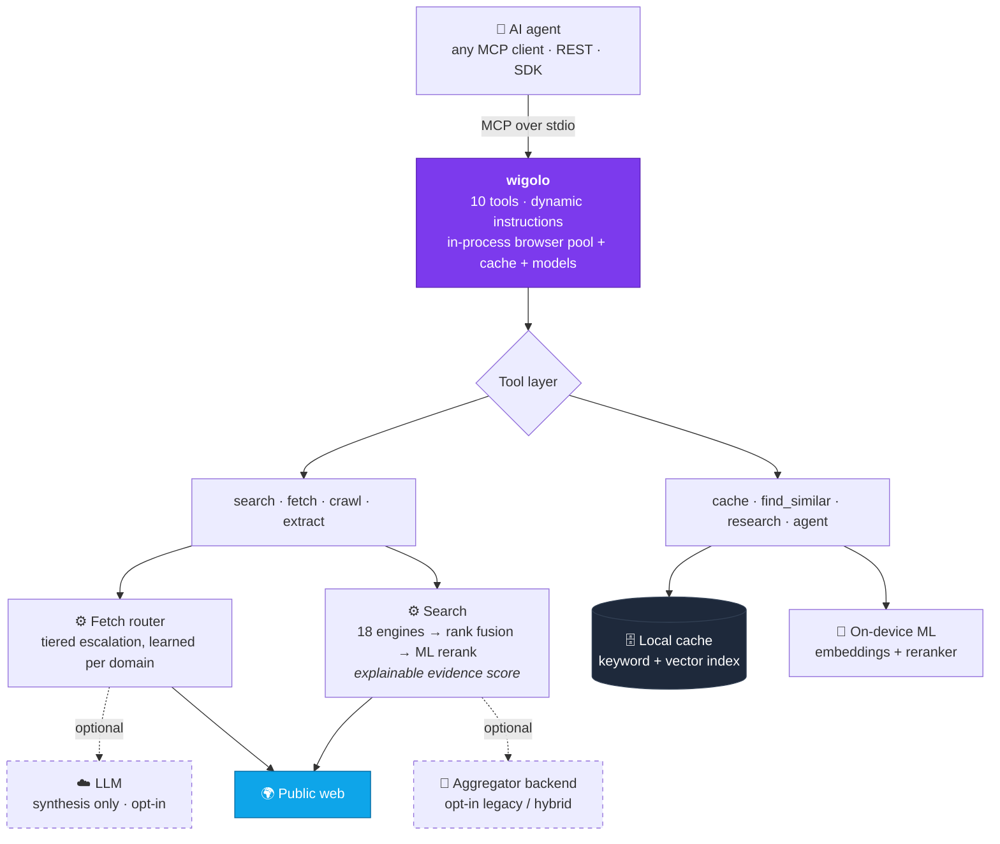

<div align="center">


面向 AI 智能体的本地优先 Web 智能工具——**无需密钥、无需云服务、没有按量计费账单。**

<sub>适用于&nbsp;&nbsp;**Claude Code · Cursor · Codex · Gemini CLI · VS Code · Windsurf · Zed · Antigravity**</sub>
<br>
<sub>以及更多场景&nbsp;&nbsp;**LangChain · CrewAI · LlamaIndex · Vercel AI SDK · n8n 与自托管智能体 · 任何 MCP 客户端 · 纯 REST**</sub>

[](https://www.npmjs.com/package/wigolo)
[](https://www.npmjs.com/package/wigolo)
[](https://github.com/KnockOutEZ/wigolo/stargazers)
[](https://github.com/KnockOutEZ/wigolo/actions/workflows/ci.yml)
[](https://nodejs.org)
[](https://modelcontextprotocol.io)
[](#许可证)
[](#beta-与反馈)
[](https://x.com/yourtowhid)

<a href="https://trendshift.io/repositories/79424?utm_source=repository-badge&utm_medium=badge&utm_campaign=badge-repository-79424" target="_blank"></a>
<a href="https://trendshift.io/repositories/79424?utm_source=trendshift-badge&utm_medium=badge&utm_campaign=badge-trendshift-79424" target="_blank" rel="noopener noreferrer"></a>

[English](README.md) · [简体中文](README.zh-CN.md) · [日本語](README.ja.md)

[快速开始](#快速开始) · [工具](#工具) · [wigolo 有何不同](#有何不同) · [基准测试](#基准测试) · [文档](docs/README.md) · [示例](examples/README.md) · [反馈](#beta-与反馈) · [常见问题](#常见问题)

新功能与更新持续发布。请在 X 上关注 <a href="https://x.com/yourtowhid"><b>@yourtowhid</b></a>，了解所有动态和使用 wigolo 的新方法；也欢迎通过 X 联系合作或提供反馈，亦可在 <a href="https://www.linkedin.com/in/yourtowhid/">LinkedIn</a> 上联系。

</div>

---

wigolo 为 AI 智能体提供统一的 Web 操作界面，涵盖**搜索、获取、抓取、提取、缓存、查找相似内容、研究**以及自主收集循环。它可以在智能体运行的任何位置运行：作为 MCP 服务器与编码智能体并行运行；作为 REST/MCP 端点部署在自托管智能体所在的机器上；或通过 SDK 嵌入你自己的应用。核心工具无需 API 密钥，所处理的任何内容都不会离开 `~/.wigolo/`，也不会随着智能体思考次数增加而产生不断上涨的账单。

<div align="center">


</div>

## 快速开始

```bash
npx wigolo init                              # set up the local engine — any system
npx wigolo init --agents=claude-code,cursor  # …or set up + wire your day-to-day agents in one command
```

需要 **Node ≥ 20**，并在 macOS、Linux 或 Windows 上预留约 1.5 GB 可用磁盘空间。直接运行 `init` 会设置本地引擎：下载浏览器引擎和设备端模型、执行健康检查，并报告每个组件的状态。添加 `--agents` 后，同一次运行还会配置指定的智能体，因此日常使用的编码智能体只需一条命令即可就绪。

- **支持的智能体**——`--agents` 接受 `claude-code`、`cursor`、`codex`、`gemini-cli`、`vscode`、`windsurf`、`zed`、`antigravity` 中的任意项（以逗号分隔）；wigolo 会为每个智能体写入 MCP 配置和说明。
- **其他设置方式**——任何 MCP 客户端、智能体框架或自托管智能体都可以在自己的 MCP 配置中注册 `npx -y wigolo`。[安装指南](docs/installation.md)提供每种客户端的准确配置块，以及 Docker、Homebrew 和单文件二进制安装渠道。
- **更多支持即将推出**——支持列表会持续扩展，也欢迎提交 PR 来添加你的智能体；请参阅 [CONTRIBUTING.md](CONTRIBUTING.md)。
- **交互式设置**——`--interactive` 提供纯文本流程；`--wizard` 提供完整的终端 TUI。
- **延后下载**——`--no-warmup` 会等到首次使用时再下载。组件下载失败不会导致设置失败；init 会报告尚未就绪的内容及准确修复方法，同时仍会完成设置。

`init` 默认无需人工干预，因此可安全用于脚本和 CI。任何设置问题都会在这里的逐组件报告中呈现，早于智能体的第一次调用。**搜索、获取、抓取、提取、缓存和查找相似内容均无需 API 密钥。**你可以随时运行以下命令检查健康状态：

```bash
npx wigolo doctor
```

要彻底移除所有内容，请运行 `npx wigolo config --uninstall --yes`。你也可以把[安装指南](docs/installation.md)粘贴到任意 AI 助手中，让它代为完成设置；该指南内容完备，可独立使用。

### 推荐——为 `research` 与 `agent` 获取免费密钥

搜索、获取、抓取、提取、缓存和查找相似内容**完全无需密钥**。`research`、`agent` 和 `search format=answer` 会使用 LLM 撰写综合且带引用的答案。没有 LLM 时，它们会返回原始简报和证据，交由你的智能体整理。免费的 Gemini 密钥可以将其转化为完整答案：

```bash
export WIGOLO_LLM_PROVIDER=gemini
export GEMINI_API_KEY=<free-key>      # grab one at aistudio.google.com/apikey — the free tier is plenty
```

任何提供商均可使用（`anthropic`、`openai`、`groq`），你也可以将 `WIGOLO_LLM_PROVIDER=ollama`（或任意兼容 OpenAI 的 URL）设为完全本地且无需密钥的方案。可在 shell 或智能体 MCP 的 `env` 块中设置。提供商、模型和无密钥本地模型降级链详见[配置指南](docs/configuration.md)。

## 智能体会获得什么

每条搜索结果都是智能体可据此行动的证据。它包含固定到来源准确位置的逐字摘录、可供智能体引用的引用 ID，以及可供检查的评分（以下为经过精简的真实结构）：

```jsonc
{
  "results": [{
    "title": "Logical replication - PostgreSQL docs",
    "url": "https://www.postgresql.org/docs/current/logical-replication.html",
    "excerpt": "Logical replication is a method of replicating data objects…",
    "citation_id": "src-1",
    "source_span": { "start": 1042, "end": 1305 },          // byte-exact provenance
    "evidence_score": { "final": 0.86, "semantic": 0.91, "lexical": 0.78, "engine_consensus": 3 }
  }],
  "citations": [{ "id": "src-1", "url": "…" }],
  "freshness_signal": { "published": "2026-05-12", "confidence": "high" }
}
```

wigolo 自身的评分器会将质量较差的结果标记为垃圾结果。失败的引擎会被报告，过期缓存也会被标注，因此智能体始终清楚其依据。每个工具的完整响应契约位于[工具参考](docs/tools.md)中。

## 工具

| 工具 | 功能 |
|------|--------------|
| 🔎 `search` | 多引擎 Web 搜索（18 个直接适配器），支持排名融合、ML 重排和可解释的逐结果评分。传入查询**数组**即可并行扩展搜索范围。可按域名和时间范围限定、匹配精确短语或返回图片结果。 |
| 📄 `fetch` | 通过分层路由器加载单个 URL；遇到反机器人挑战或 SPA 外壳时，会从普通 HTTP 自动升级到无头浏览器引擎。返回干净的 Markdown、元数据和链接。支持 PDF、单个标题 `section`、已认证会话，以及页面操作（点击、输入、滚动、截图）。 |
| 🕸️ `crawl` | 多页面抓取，可使用 BFS、DFS、站点地图或仅映射模式。支持按域名限速、遵守 robots.txt 及样板内容去重。 |
| 🧩 `extract` | 从页面提取结构化数据：表格、元数据、JSON-LD、品牌标识、命名 schema（Article、Recipe、Product 等），或任意自定义 JSON Schema。 |
| 💾 `cache` | 查询已访问的所有内容，可使用关键词或混合语义检索，并提供统计、清除和变更检测功能。 |
| 🧲 `find_similar` | 通过关键词、语义和实时 Web 三路融合，查找与某个 URL 或概念相似的页面。 |
| 🧠 `research` | 分解问题 → 并行发出子查询 → 获取来源 → 综合为带引用的报告（或由宿主 LLM 撰写的结构化简报）。 |
| 🤖 `agent` | 自主收集循环：规划 → 搜索 → 获取 → 提取 → 综合，并包含步骤日志、时间预算和可选输出 schema。 |
| 🔁 `diff` + ⏱️ `watch` | 查看页面自上次访问以来的准确变化；按需重新检查，并将变化发送到 webhook。 |

每个工具也都可以从终端运行（`wigolo search "…" --json`）、通过支持 NDJSON 管道的交互式 shell（`wigolo shell`）运行、通过 REST 调用，或通过 SDK 使用——请参阅 [CLI 参考](docs/cli.md)。每个工具的指南和完整参数集位于 [docs/tools.md](docs/tools.md)，可运行示例位于 [examples/](examples/README.md)。

## 有何不同

wigolo 并非付费工具的廉价替代品——它的目标就是达到同等水准。它是面向智能体的专用 Web 层：智能体可以直接调用其 MCP 和 REST 接口，获得付费服务才会提供的搜索与提取质量。它的不同之处在于：

- **专为智能体构建。**一次 MCP 调用即可跨多个引擎并行展开多个查询，这是串行宿主工具循环无法复制的。每条结果都带有透明的逐结果评分，且输出会顾及上下文预算。
- **输出诚实透明。**过期缓存、获取失败、后端降级和截断都会在结果中明确呈现。无法读取受机器人保护的页面时，你会得到标记为 `blocked_by_challenge` 的失败，而不是挑战页面外壳冒充的内容。
- **每次查询成本为 0 美元，可自由重新查询。**默认搜索通过直接适配器访问公共引擎；重排器和嵌入模型在设备端运行。每个响应都会缓存，因此再次询问可即时获得结果且不产生费用。
- **默认保护隐私。**缓存、嵌入、模型和配置均位于 `~/.wigolo/`。除非你明确选择使用 LLM 进行综合，否则任何内容都不会发送给第三方。

下面对一条真实结果进行拆解。失败的引擎和质量较差的结果也会展示，因为它们同样是答案的一部分：

<div align="center">

<picture>
<source media="(prefers-color-scheme: dark)" srcset="assets/promo/anatomy-dark.svg">

</picture>

</div>

## 基准测试

> **四种工具得出了相同的核心答案，而其中只有一种返回了逐字且精确定位到字节的证据。**

一次冷启动查询在同一个 **Claude Fable 5** 会话中实时运行，并以同等条件并行交给四种 Web 工具（内置 **WebSearch**、**wigolo**、**Tavily**、**Exa**），随后由智能体仅根据证据进行评判。四者得出了相同的答案和同一个首要来源，因此屏幕上的结果证明了它们达到了同等水平。只有 wigolo 返回了固定到字节偏移来源范围的逐字摘录、可解释的评分分解和实时逐引擎遥测，其自身评分器还将两个较差结果标记为垃圾结果。云端工具也各有优势：Exa 完整渲染了官方文档的对比矩阵。你可以运行自己的查询，并看到相同的结果结构。

<div align="center">


</div>

### 对比情况

| | wigolo | Firecrawl | Exa | Tavily |
|---|:---:|:---:|:---:|:---:|
| 多引擎 Web 搜索 | ✅ | ✅ | ✅ | ✅ |
| 获取与结构化提取 | ✅ | ✅ | ✅ | ✅ |
| 整站抓取与映射 | ✅ | ✅ | — | ✅ |
| 固定到字节偏移来源范围的逐字摘录 | ✅ | — | — | — |
| 可解释的逐结果评分分解 | ✅ | — | — | — |
| 持久化本地记忆——即时、离线重新查询 | ✅ | — | — | — |
| 查询数据留在本机 | ✅ | — | — | — |
| API 密钥/账户 | 无需 | 必需 | 必需 | 必需 |
| 每次查询成本 | 0 美元 | 按量计费 | 按量计费 | 按量计费 |

<sub>功能状态截至 2026 年 7 月——请查阅各供应商文档了解当前状态。</sub>

最后一行的影响会不断累积，因为智能体往往会突发式地提出大量查询：

<div align="center">

<picture>
<source media="(prefers-color-scheme: dark)" srcset="assets/promo/meter-dark.svg">

</picture>

</div>

## 编辑器之外

无论智能体属于哪种类型，都可以通过合适的接口使用相同的十种工具：编码智能体使用 MCP，其他场景使用 REST，需要嵌入时使用 SDK，还可直接接入框架包装器。

### REST API——`wigolo serve`

一个进程即可在 MCP 传输旁提供纯 JSON REST API。无需 MCP 客户端，只需 curl：

```bash
wigolo serve                          # 127.0.0.1:3333 — loopback is open; off-loopback requires a token

curl -sX POST http://127.0.0.1:3333/v1/search \
  -H 'Content-Type: application/json' \
  -d '{"query":"local-first software","max_results":5}'
```

`POST /v1/{tool}` 覆盖全部十种工具，`GET /openapi.json` 提供 OpenAPI 3.1 契约，`/mcp` 和 `/sse` 则通过同一端口为远程 MCP 客户端提供服务。绑定到回环地址之外时必须提供 bearer token，因此服务器默认采用失败关闭策略。可让 n8n、Hermes 风格助手或任何自托管智能体指向该端点。→ [REST API](docs/rest-api.md)

### SDK——TypeScript 与 Python

轻量、带类型的客户端，提供嵌入式本地模式，可以自动发现或启动守护进程，无需单独执行 `serve`。

**TypeScript**——`npm install wigolo-sdk`（零依赖；支持 Node、Bun、Deno 和 edge）：

```ts
import { createLocalClient } from 'wigolo-sdk/local';

const { client, close } = await createLocalClient();   // reuse a running daemon, or spawn one
const res = await client.search({ query: 'local-first web search', max_results: 5 });
console.log(res.results.map((r) => r.title));
await close();                                          // stops the daemon only if this call spawned it
```

**Python**——`pip install wigolo`（仅使用标准库；支持同步与异步）：

```python
from wigolo import local_client

with local_client() as client:                          # reuse a healthy daemon, or spawn one
    res = client.search(query="local-first web search", max_results=5)
    for r in res["results"]:
        print(r["title"], r["url"])
```

→ [SDK 与嵌入式模式](docs/sdks.md)

### 框架集成

将 wigolo 的工具直接接入你已经使用的框架。你会获得完整的十种工具，包括多数框架 Web 工具并不提供的 cache、find_similar、research 和 agent：

| 框架 | 软件包 | 可获得的功能 |
|-----------|---------|--------------|
| **LangChain** | `wigolo-langchain` | 每个工具都作为 `BaseTool` 提供，另有一个基于 search/find_similar、用于 RAG 的 `BaseRetriever` |
| **CrewAI** | `wigolo-crewai` | `wigolo_tools()` → 将整套工具交给任意 crew |
| **LlamaIndex** | `wigolo-llamaindex` | 一个 `BaseReader`，可将已获取、抓取或搜索到的页面作为文档加载 |
| **Vercel AI SDK** | `wigolo-vercel-ai-sdk` | 用于 `generateText`/`streamText` 的工具工厂，兼容 edge |

→ [框架集成](docs/sdks.md)

### Docker

```bash
# stdio MCP — wire it into any MCP client as command: docker
docker run -i --rm -v wigolo-data:/data ghcr.io/knockoutez/wigolo

# HTTP server for remote / multi-client use
docker run -p 3333:3333 -v wigolo-data:/data \
  -e WIGOLO_API_TOKEN=a-long-random-secret \
  ghcr.io/knockoutez/wigolo serve --host 0.0.0.0
```

精简镜像会将模型延迟加载到卷中；`:full` 会预装浏览器引擎。Docker Hub 上也提供 `towhid69420/wigolo`。→ [安装与所有渠道](docs/installation.md)

### 智能体技能

一套包含 11 项内容的技能目录会教编码智能体如何妥善使用每种工具。它由 `init` 安装，并通过 `wigolo skills add|list|remove` 管理。→ [技能](docs/skills.md)

自托管用户请注意：一些受挑战保护的网站会评估 IP 信誉，因此数据中心 IP 可能无法通过家庭网络可以通过的防护墙。wigolo 会标记这些失败，[自托管指南](docs/self-hosting.md)介绍了可选择启用的代理解决方案。

## Star 历史

<div align="center">

<a href="https://www.star-history.com/#KnockOutEZ/wigolo&Date">
<picture>
<source media="(prefers-color-scheme: dark)" srcset="https://raw.githubusercontent.com/KnockOutEZ/wigolo/star-chart/star-history-dark.svg">

</picture>
</a>

<sub>每天通过 GitHub API 刷新。如果 wigolo 对你有用，请<a href="https://github.com/KnockOutEZ/wigolo">点一个 ⭐</a>。</sub>

</div>

## 架构

单个 Node 进程通过 stdio 使用 MCP（JSON-RPC）。所有重型组件都在本地按需加载，因此无密钥安装不会为未使用的部分付出代价。



- **能用代码完成的工作不交给模型。**确定性任务由代码处理，包括规范化、排名融合、去重和 schema 匹配。模型仅用于判断，需主动选择启用，并限制每次请求的用量。LLM 填充的字段会与来源核对，不存在时则设为 null。
- **信号驱动的路由。**获取阶梯根据可观察信号而非域名猜测来升级到真实浏览器，包括 SPA 标记、挑战响应体和内容过少。它会针对每个域名学习；网站不再需要时也会取消学习。`wigolo tune list` 会准确显示它学到了什么。
- **像浏览器一样读取页面。**分层获取会等待中间挑战结束，并按域名复用放行凭据，同时保持礼貌：遵守 robots.txt、按域名限速，使用研究级访问量。如果仍然无法通过防护墙，失败会被标记并报告。

## 配置

全新安装开箱即用。以下三项设置可以提高输出质量：

```bash
# 1. Synthesis — the biggest lever (research / agent / search-answer write real prose)
export WIGOLO_LLM_PROVIDER=gemini                   # or anthropic / openai / groq / ollama (keyless)
export GEMINI_API_KEY=<your-key>

# 2. Wider retrieval funnel
export WIGOLO_SEARCH=hybrid                         # core engines + aggregator fallback
export WIGOLO_GITHUB_TOKEN=...                      # GitHub code search 10 → 30 req/min

# 3. Land more fetches, stay warm
export WIGOLO_TLS_TIER=auto                         # per-domain learned fetch hardening
export WIGOLO_EAGER_WARMUP=1                        # pay the ~1s model load up front
```

**值得采用的逐调用习惯：**使用查询**数组**（`["a","b","c"]`）并行扩展范围；对重要查询使用 `search_depth: "deep"`；使用 `include_domains` 作为文档查找的硬性过滤条件。完整参考涵盖所有环境变量、配置文件键、搜索后端、缓存 TTL 和 serve 限制，详见[配置指南](docs/configuration.md)。

## 文档与示例

**[docs/](docs/README.md)**——完整手册：
[入门](docs/getting-started.md) · [安装与渠道](docs/installation.md) · [配置](docs/configuration.md) · [工具参考](docs/tools.md) · [CLI 与 shell](docs/cli.md) · [REST API](docs/rest-api.md) · [SDK 与集成](docs/sdks.md) · [自托管](docs/self-hosting.md) · [智能体技能](docs/skills.md) · [插件](docs/plugins.md) · [故障排除与常见问题](docs/troubleshooting.md) · [隐私与安全](docs/privacy-security.md)

**[examples/](examples/README.md)**——可运行示例，每个示例都有 README（大多数还包含终端录制）：一次性 CLI、NDJSON shell 管道、通过 curl 使用 REST、TypeScript 与 Python SDK、Vercel AI SDK 工具、让自托管 n8n 指向远程 wigolo、使用 webhook 监视，以及编写自己的搜索引擎插件。文档也会渲染到网站 **[knockoutez.github.io/wigolo/docs](https://knockoutez.github.io/wigolo/docs/)**。

## Beta 与反馈

wigolo 目前处于**公开 Beta** 阶段。这里记录的所有功能都可正常工作，并由 7,600 项测试套件保障；它已经稳定，Beta 阶段关注的是打磨程度。只有当足够多的人使用、检验并为它加星，使“v1”名副其实之后，它才会结束 Beta。你的反馈会影响下一步发展，每一份报告都会被阅读，通常就在当天：

- 🐛 **[报告错误](https://github.com/KnockOutEZ/wigolo/issues/new?template=bug_report.yml)**——出现故障、行为异常或结果出乎意料
- 💡 **[请求功能](https://github.com/KnockOutEZ/wigolo/issues/new?template=feature_request.yml)**——你认为它应该实现的功能
- 💬 **[提出任何问题](https://github.com/KnockOutEZ/wigolo/discussions)**——问题、设置、成果展示与交流

如果 wigolo 在你的工作流中有一席之地，有三种方式可以帮助它持续发展：点一个 ⭐ **Star**（开源软件正是这样被发现的）、请作者喝一杯**[☕ 咖啡](https://buymeacoffee.com/knockoutez)**（这里没有付费层，以后也不会有），或者发一封**[电子邮件](mailto:ktowhid20@gmail.com)**，直接联系编写全部代码的唯一开发者。

## 故障排除

`wigolo doctor` 会指出发生故障的组件，以及可修复问题的准确环境变量或命令；`wigolo doctor --fix` 会修复常见问题，`wigolo verify` 则对每个组件进行健康检查。组件在 `init` 期间失败不会破坏 wigolo：`init` 仍会以状态码 0 退出，且核心 search、fetch、crawl、extract 和 cache 在没有模型与浏览器时仍可工作。常见问题速查：

- **下载缓慢或失败**——重新运行 `wigolo warmup --all`（或 `--browser`、`--embeddings`、`--reranker`）；下载会继续并重试。
- **浏览器无法在 Linux 上启动**——`wigolo warmup --browser` 会安装操作系统库（或输出准确命令）。
- **原生构建错误/不常见的 Node 版本**——使用 LTS 版本：**Node 20、22 或 24**。
- **位于代理之后**——设置 `USE_PROXY=true` 和 `PROXY_URL`；若代理会检查 TLS，请添加 `NODE_EXTRA_CA_CERTS`。

完整指南按具体症状提供解决方案，还包含“当 X 失败时哪些功能仍可工作”的映射、平台说明（包括 linux-arm64）和离线安装方法：**[docs/troubleshooting.md](docs/troubleshooting.md)**。

## 常见问题

<details>
<summary><b>免费吗？有什么隐藏条件？</b></summary>

从设计上就没有隐藏条件。昂贵的部分（排名、嵌入和浏览器引擎）都在*你的*硬件上运行，因此无需回收逐次查询成本，也就没有设置计量器的理由。项目依靠捐赠维持，而 AGPL 许可证从法律上防止它转变为闭源托管产品。

</details>

<details>
<summary><b>质量真的能与付费服务相当吗？</b></summary>

上面的基准测试是可复现的实时四方比较：在日常智能体查询中，结果达到了同等水准；付费工具在一些深度提取的边缘案例中仍然更胜一筹，而抓取是 wigolo 最强的领域。每条结果都会展示评分，因此你无需仅凭作者的一面之词。

</details>

<details>
<summary><b>公共搜索引擎不会封锁请求或逐渐失效吗？</b></summary>

它正是为应对这种情况而设计的：18 个引擎通过排名融合组合（任意一个失败都几乎不会影响结果）、带逐域名学习功能的分层获取阶梯，以及可选的聚合器回退。降级的后端会在输出中报告，而本地缓存意味着已访问的所有内容始终可用，不受外部情况影响。

</details>

<details>
<summary><b>这种抓取方式合规吗？</b></summary>

wigolo 像浏览器一样读取公共 Web：默认遵守 robots.txt、按域名限速，并采用适合单个智能体的研究级访问量。它刻意选择了礼貌访问的一端。

</details>

<details>
<summary><b>AGPL——可以在工作中使用吗？</b></summary>

可以，整个公司都能免费使用。只有当你*修改 wigolo 并将其作为网络服务运行*时，许可证才会产生义务；此时必须公开这些修改。将它用作本地开发工具不会带来任何义务。如有商业许可问题，请联系作者。

</details>

<details>
<summary><b>为什么需要 1.5 GB 磁盘空间？</b></summary>

这是设备端“大脑”所需的空间：完整浏览器引擎，以及云服务在服务器端运行并向你收费的排名和嵌入模型。下载到磁盘后，每次查询都可以免费使用它们。

</details>

## 获取渠道

- **npm**——[`wigolo`](https://www.npmjs.com/package/wigolo)（主要渠道——见上面的快速开始）
- **PyPI**——[`wigolo`](https://pypi.org/project/wigolo/)（Python SDK）
- **Docker**——[`ghcr.io/knockoutez/wigolo`](https://github.com/KnockOutEZ/wigolo/pkgs/container/wigolo) · [`towhid69420/wigolo`](https://hub.docker.com/r/towhid69420/wigolo)
- **官方 MCP Registry**——`io.github.KnockOutEZ/wigolo`
- **目录**——[Glama](https://glama.ai/mcp/servers/KnockOutEZ/wigolo) · [Smithery](https://smithery.ai/server/ktowhid20/wigolo) · [mcp.so](https://mcp.so/server/wigolo/KnockOutEZ) · [LobeHub](https://lobehub.com/mcp/knockoutez-wigolo)

Homebrew、`curl | sh` 和单文件二进制的使用方式见[安装指南](docs/installation.md)。每台机器只使用一个安装渠道；它们都共享 `~/.wigolo`。

## 参与贡献

欢迎提交错误报告、功能请求和 PR；请参阅 **[CONTRIBUTING.md](CONTRIBUTING.md)**。让工具处理程序保持精简、添加测试，并在创建 PR 前运行测试套件。最容易上手的是自定义搜索引擎和提取器的插件系统：请参阅[用约 100 行代码添加搜索引擎](docs/plugins.md)，模板位于 [`examples/plugin-search-engine`](examples/plugin-search-engine)。

## 许可证

**[GNU AGPL-3.0-only](LICENSE)。**可自由使用、修改和自托管，包括在公司内部使用。唯一的义务是：如果将**修改后的**版本作为网络服务运行，就必须以相同许可证发布修改后的源代码。这能让 wigolo 保持开放，同时防止出现闭源托管分支。安全漏洞请按照 **[SECURITY.md](SECURITY.md)** 报告，名称使用方式请参阅 **[TRADEMARK.md](TRADEMARK.md)**。如有商业许可问题，请联系作者。

<div align="center">
<br>

wigolo 免费且积极维护，并且会一直如此。
如果它帮你省下了按量计费的搜索账单，点一个 ⭐、提交一份精准的 Issue，或请作者喝一杯**[☕ 咖啡](https://buymeacoffee.com/knockoutez)**，都能帮助项目持续发展。

<sub>由 <a href="https://github.com/KnockOutEZ">@KnockOutEZ</a> 构建和维护 · <a href="mailto:ktowhid20@gmail.com">ktowhid20@gmail.com</a> · <a href="https://x.com/yourtowhid">X</a> · <a href="https://www.linkedin.com/in/yourtowhid/">LinkedIn</a></sub>

</div>
